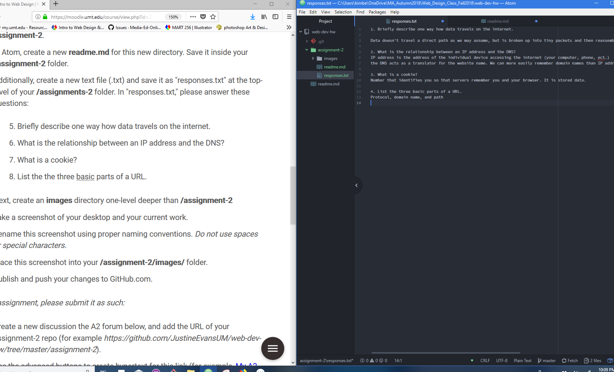

# Kimberly Pierson Assignment 2

Version Control System is a system that keeps a detailed history of all the changes that have happened. It helps with collaboration as each person’s changes are saved and it makes for a great system of organization. Makes sense we're using this in this class to stay clean and backtrack within our work.

[responses](./responses.txt)

Continuing to refamiliarizing myself with github and atom and bookmarking my markdowncheat sheet in multiple places for immediate access when my brain decides to be forgetful. I'm exited to dive in!
