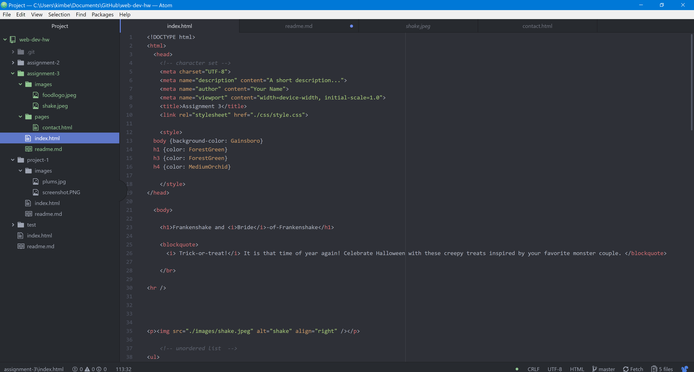

# Kimberly Pierson / Assignment 3

- A page can only have one head and body element. The head's role is a container for the page's format and style and this information is not visible, whereas the body is the container in which all displayed content is set up and its arrangement *is* viewable.

- Structure is the more overarching format and layout of a page, whereas Semantic defines a page's intended nuances within, for example emphasis to text through italics.

- Getting more and more familiar with the myriad of tiny meticulous details within HTML. It is fun. This week wasn't too bad. I am excited to learn about CSS so that I can manipulate fonts... I am weary of times new roman.

