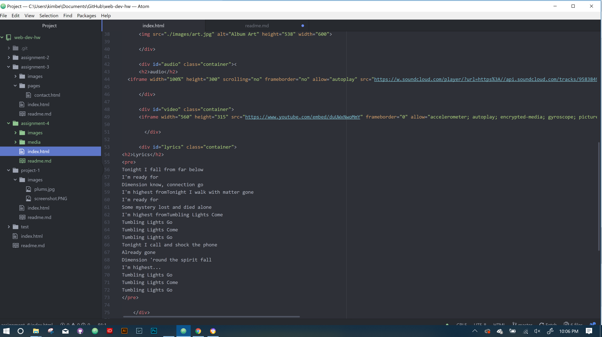

# Kimberly Pierson A4 Readme

B.) Ids and classes are naming attributes.

Ids are 'global identifiers' and are for one element, only.

Classes group similar elements together.

Divs and spans provide structure and organization but div is for block elements and span is for inline elements. Both are types of structuring. Spans group together content organizationally and stylistically and can be contained within divs, but both need id or class attributes.

C.) Alt text provides description of the content - it makes for proper accessibility to all especially in browsers where the content is broken and not loading, the alt text will appear to describe what you cannot see, also helpful for those visually impaired.

D.) Pretty straightforward this week - albeit kicking myself for being 24 hours late on this assignment, I am not kicking myself for a lack of keeping up with the content. *high fives self*

E.) 
