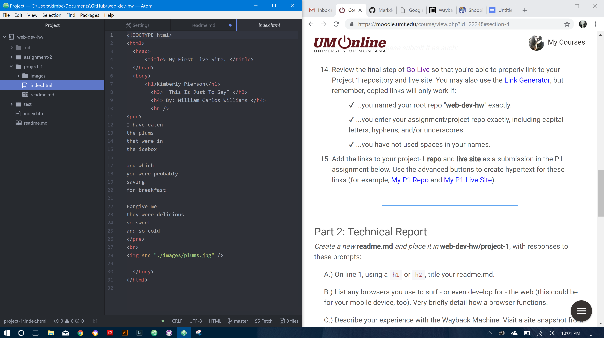

# Kimberly Pierson - Project-1 Technical Report

B. I use Firefox, Chrome, and most recently an Avast browser that installed itself on my new laptop and made itself sneakily the default.  On my phone I usually use Safari as I am not fond of Chrome's browser app on my phone, but perhaps only because I am so accustomed to Safari's. Browsers work by sending a request to a server of the webpage you wish to access. The server then responds, and the browser interprets the html, css, images ect. and displays its content to us.

C. The Wayback Machine is such an interesting thing, I never knew it existed! I looked back on old versions of a website I made for my mom... the farthest back was in 2013, albeit not being terribly ‘old’ it was still so awful looking I could die, haha! I decided to be nostalgic for myspace and looked at the first snapshot taken in [December of 1996](https://web.archive.org/web/19961221174030/http://www.myspace.com:80/). It hurts my eyes a bit, apparently they started out as a website builder for businesses.

D. This homework assignment was really nice via the encouraged method of organizing our assignments within the functioning index.html. (side-note: I am going crazy with how tiny my laptop screen is and need to seek out an external monitor to follow along with the material in a more efficient manner...  oof!) Problems were only that my linter isn’t properly working. I downloaded the 'linter-tidy' and it keeps popping up error messages in a descending annoyance that I decided to uninstall it. I had this problem with linter-tidy in the last spring semester of creative coding and I was using a different laptop then so I am wondering if I am just installing the wrong linter, or ...?

E. here's an example of how I've been working with this teeny tiny laptop screen... gah!!!  
