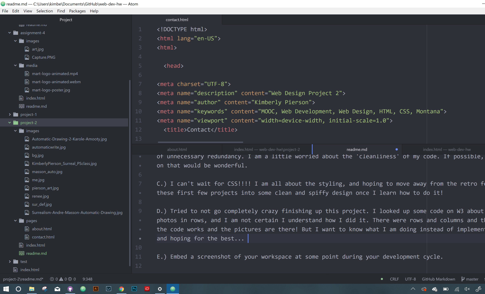

# Kimberly Pierson

B.) Briefly recap your experience learning HTML. What was old, new, interesting, or difficult to learn?

B.) It hurt, to say the least. I forgot about combining my div id and classes, so at first there was a lot of unnecessary redundancy. I am a little worried about the 'cleanliness' of my code. If possible, feedback on that would be wonderful.

C.) I can't wait for CSS!!!! I am all about the styling, and hoping to move away from the retro feel of these first few projects into some clean and spiffy design once I learn how to do it!

D.) Tried to not go completely crazy finishing up this project. I looked up some code on W3 about putting photos in rows, and I am not certain I understand how I did it. There were rows and columns and thankfully the code works and the pictures are there! But I want to know what I am doing instead of implementing code and hoping for the best...

E.) Embed a screenshot of your workspace at some point during your development cycle.

