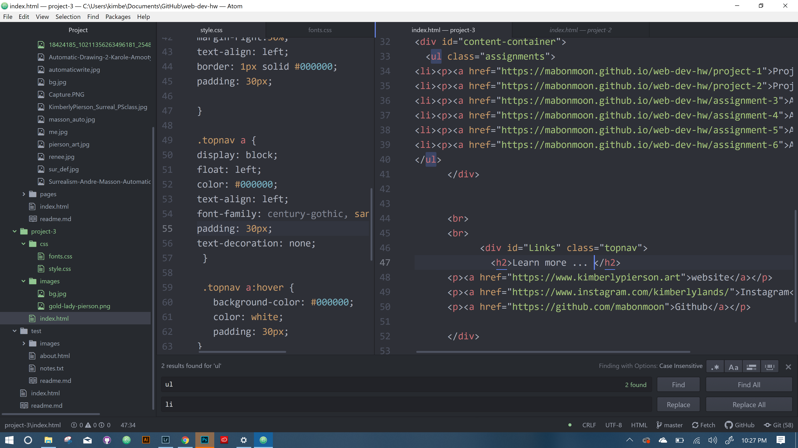

# Kimberly Pierson

What is the difference between padding, margin, and borders?

They are like onion skins that can vary in their sizes

Padding is an specified area around the content you include on a page. It is transparent.

Border is above and around the padding ... you can adjust this in colors and sizes.

margin is outside of the border...

What was the hardest task for you to accomplish this assignment?

Creating a layout and also working with sizing. I still wish I could figure out a few things to make it more aesthetically pleasing, but I am endlessly doing minor tweaks and to avoid madness I will call it good.

Thanks for the semester. Sometimes I felt like I got it, and other times I felt helplessly lost. I definitely wish I was able to take this kind of a class in-person. I have so many questions, but I did learn a lot. I still have a ways to go :)

